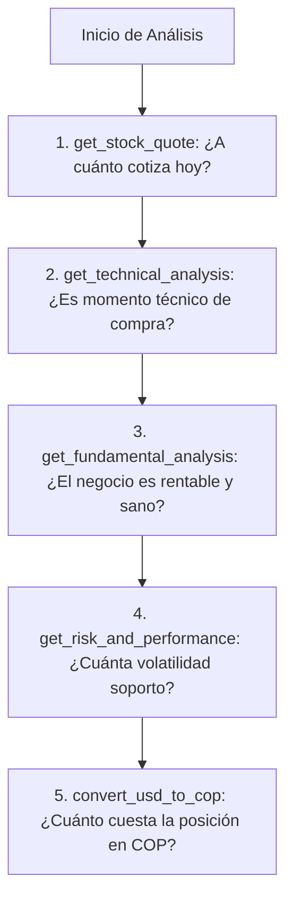

# Guía Completa de Uso: Servidor MCP de Análisis Bursátil

Esta guía documenta cómo utilizar las herramientas de análisis técnico, fundamental, de riesgo y divisas del servidor MCP `StockAnalysisServer`.

---

## 📋 Índice

1. [Requisitos Previos](#1-requisitos-previos)
2. [Formas de Utilizar las Herramientas](#2-formas-de-utilizar-las-herramientas)
3. [Catálogo Detallado de Herramientas](#3-catálogo-detallado-de-herramientas)
   - [1. get_stock_quote](#1-get_stock_quote)
   - [2. get_technical_analysis](#2-get_technical_analysis)
   - [3. get_fundamental_analysis](#3-get_fundamental_analysis)
   - [4. get_risk_and_performance](#4-get_risk_and_performance)
   - [5. compare_stocks](#5-compare_stocks)
   - [6. get_historical_candles](#6-get_historical_candles)
   - [7. get_colombian_trm](#7-get_colombian_trm)
   - [8. convert_usd_to_cop](#8-convert_usd_to_cop)
   - [9. get_international_stock_price](#9-get_international_stock_price)
4. [Estrategias de Análisis Combinado](#4-estrategias-de-análisis-combinado)
5. [Solución de Problemas Frecuentes](#5-solución-de-problemas-frecuentes)

---

## 1. Requisitos Previos

Antes de ejecutar comandos en la terminal, siempre asegúrate de tener activo el entorno virtual del proyecto:

```bash
# Desde la raíz del proyecto (mcp_stock)
source .venv/bin/activate
```

El prompt de la terminal debe mostrar `(.venv)` al inicio.

---

## 2. Formas de Utilizar las Herramientas

Tienes tres métodos para interactuar con el servidor:

### Método A: En el Chat del Asistente de IA (Antigravity / Gemini)
Escribe en lenguaje natural lo que necesitas analizar. El modelo seleccionará la herramienta adecuada y ejecutará el análisis automáticamente.

### Método B: Línea de Comandos (`fastmcp call`)
Permite invocar herramientas directamente desde la consola enviando argumentos en formato JSON:

```bash
fastmcp call server.py <nombre_herramienta> '<argumentos_en_json>'
```

### Método C: Inspector Web Gráfico (`fastmcp dev inspector`)
Abre una interfaz en el navegador para probar visualmente cada parámetro:

```bash
fastmcp dev inspector server.py
```

---

## 3. Catálogo Detallado de Herramientas

---

### 1. `get_stock_quote`

Obtiene la cotización en tiempo real (o último cierre disponible) de una acción, ETF o índice, junto con el volumen y rango de 52 semanas.

* **Parámetros:**
  * `ticker` *(string, obligatorio)*: Símbolo bursátil. Ej: `"AAPL"`, `"MSFT"`, `"NVDA"`, `"SPY"`.

* **Uso en Terminal:**
  ```bash
  fastmcp call server.py get_stock_quote '{"ticker": "MSFT"}'
  ```

* **Ejemplo de Consulta al Asistente:**
  > *"¿A cuánto cotiza hoy Microsoft y cuál ha sido su variación en el día?"*

* **Campos clave que devuelve:**
  * `current_price`: Precio actual o de último cierre.
  * `day_change` y `day_change_pct`: Variación absoluta y porcentual en la sesión.
  * `day_high` y `day_low`: Máximo y mínimo de la sesión.
  * `market_cap`: Capitalización bursátil en notación legible (`B` = miles de millones, `T` = billones).
  * `52w_high` y `52w_low`: Rango de precio en el último año.

---

### 2. `get_technical_analysis`

Ejecuta un motor analítico cuantitativo que calcula osciladores de momento, medias móviles y bandas de volatilidad con interpretación automática de señales.

* **Parámetros:**
  * `ticker` *(string, obligatorio)*: Símbolo bursátil. Ej: `"AAPL"`.
  * `period` *(string, opcional, por defecto `"1y"`)*: Historial de cálculo. Opciones: `"3mo"`, `"6mo"`, `"1y"`, `"2y"`.

* **Uso en Terminal:**
  ```bash
  fastmcp call server.py get_technical_analysis '{"ticker": "AAPL", "period": "1y"}'
  ```

* **Ejemplo de Consulta al Asistente:**
  > *"Haz un análisis técnico de Apple. ¿El RSI está en sobrecompra o sobreventa?"*

* **Indicadores calculados:**
  * **RSI (14)**: Índice de Fuerza Relativa con suavizado Wilder.
    * `> 70`: Sobrecompra (alerta de posible retroceso).
    * `< 30`: Sobreventa (alerta de posible rebote).
    * `30 - 70`: Rango neutral.
  * **MACD (12, 26, 9)**: Línea MACD, línea de señal e histograma con estado alcista/bajista de cruce.
  * **Bandas de Bollinger (20, 2)**: Banda superior, media, inferior y posición relativa `%B`.
  * **Medias Móviles**: SMA 20, SMA 50, SMA 200 y EMA 20.
  * **`analysis_notes`**: Diagnóstico automatizado (ej. *"Alineación alcista: SMA 50 > SMA 200"*).

---

### 3. `get_fundamental_analysis`

Extrae ratios de valuación financiera, métricas de rentabilidad, salud del balance y consenso de analistas de Wall Street.

* **Parámetros:**
  * `ticker` *(string, obligatorio)*: Símbolo bursátil. Ej: `"GOOGL"`, `"TSLA"`.

* **Uso en Terminal:**
  ```bash
  fastmcp call server.py get_fundamental_analysis '{"ticker": "NVDA"}'
  ```

* **Ejemplo de Consulta al Asistente:**
  > *"¿Cuáles son los ratios de valuación y rentabilidad de NVIDIA? ¿Qué opinan los analistas?"*

* **Métricas devueltas:**
  * **Valuación**: `trailing_pe` (PER pasado), `forward_pe` (PER estimado), `peg_ratio`, `price_to_book`, `enterprise_to_ebitda`.
  * **Rentabilidad y Salud**: `net_profit_margin_pct` (Margen neto), `return_on_equity_pct` (ROE), `debt_to_equity` (Deuda/Patrimonio), `current_ratio` (Liquidez), `free_cashflow` (Flujo de caja libre).
  * **Dividendos y Objetivos**: `dividend_yield_pct`, `target_mean_price` (Precio objetivo promedio) y `recommendation` (`BUY`, `HOLD`, `UNDERPERFORM`).

---

### 4. `get_risk_and_performance`

Calcula el perfil de riesgo del activo: retorno total, desglose histórico, volatilidad anualizada y riesgo de caída extrema (*Drawdown*).

* **Parámetros:**
  * `ticker` *(string, obligatorio)*: Símbolo bursátil. Ej: `"TSLA"`, `"SPY"`.
  * `period` *(string, opcional, por defecto `"1y"`)*: Opciones: `"6mo"`, `"1y"`, `"2y"`, `"5y"`.

* **Uso en Terminal:**
  ```bash
  fastmcp call server.py get_risk_and_performance '{"ticker": "TSLA", "period": "1y"}'
  ```

* **Ejemplo de Consulta al Asistente:**
  > *"¿Cuál es la volatilidad anualizada y la máxima caída de Tesla en el último año?"*

* **Métricas devueltas:**
  * `cumulative_return_pct`: Ganancia o pérdida total en el periodo analizado.
  * `annualized_volatility_pct`: Desviación estándar anualizada de retornos diarios (a mayor número, mayor riesgo).
  * `max_drawdown_pct`: La peor caída porcentual registrada desde el punto más alto histórico en el periodo.
  * `returns_breakdown`: Rendimiento acumulado a 1 semana, 1 mes, 3 meses, 6 meses y 1 año.

---

### 5. `compare_stocks`

Compara múltiples activos simultáneamente bajo las mismas condiciones temporales para identificar el líder en rendimiento o el de menor riesgo.

* **Parámetros:**
  * `tickers` *(lista de strings, obligatorio)*: Lista de símbolos a comparar. Ej: `["AAPL", "MSFT", "GOOGL"]`.
  * `period` *(string, opcional, por defecto `"1y"`)*: Periodo de evaluación.

* **Uso en Terminal:**
  ```bash
  fastmcp call server.py compare_stocks '{"tickers": ["AAPL", "MSFT", "GOOGL"], "period": "1y"}'
  ```

* **Ejemplo de Consulta al Asistente:**
  > *"Compara el rendimiento y riesgo entre Apple, Microsoft y Alphabet en el último año."*

* **Resultado:**
  * Tabla clasificada de mayor a menor retorno acumulado, contrastando volatilidad, drawdown y ratio P/E.

---

### 6. `get_historical_candles`

Entrega series temporales de velas japonesas (*OHLCV*: Apertura, Máximo, Mínimo, Cierre y Volumen) útiles para graficar o analizar patrones de velas.

* **Parámetros:**
  * `ticker` *(string, obligatorio)*: Símbolo bursátil. Ej: `"AMZN"`.
  * `period` *(string, opcional, por defecto `"1mo"`)*: `"5d"`, `"1mo"`, `"3mo"`, `"6mo"`, `"1y"`.
  * `interval` *(string, opcional, por defecto `"1d"`)*: Temporalidad de cada vela (`"15m"`, `"1h"`, `"1d"`, `"1wk"`).
  * `limit` *(entero, opcional, por defecto `30`)*: Cantidad de velas recientes a retornar.

* **Uso en Terminal:**
  ```bash
  fastmcp call server.py get_historical_candles '{"ticker": "AMZN", "limit": 5}'
  ```

* **Ejemplo de Consulta al Asistente:**
  > *"Dame las últimas 5 velas diarias de Amazon con sus precios de apertura y cierre."*

---

### 7. `get_colombian_trm`

Consulta la Tasa Representativa del Mercado (TRM) oficial vigente en Colombia desde el portal nacional de Datos Abiertos (`datos.gov.co`).

* **Parámetros:**
  * Ninguno.

* **Uso en Terminal:**
  ```bash
  fastmcp call server.py get_colombian_trm
  ```

* **Ejemplo de Consulta al Asistente:**
  > *"¿Cuál es la TRM oficial de hoy en Colombia?"*

* **Campos devueltos:**
  * `trm_cop_per_usd`: Tasa de cambio oficial en pesos colombianos por dólar.
  * `effective_from` / `effective_to`: Rango de vigencia de la tasa.

---

### 8. `convert_usd_to_cop`

Realiza la conversión matemática directa de un monto en dólares (USD) a pesos colombianos (COP) consultando en tiempo real la TRM vigente.

* **Parámetros:**
  * `usd_amount` *(float, obligatorio)*: Monto en dólares a convertir.

* **Uso en Terminal:**
  ```bash
  fastmcp call server.py convert_usd_to_cop '{"usd_amount": 150}'
  ```

* **Ejemplo de Consulta al Asistente:**
  > *"¿Cuánto son $450 dólares en pesos colombianos al cambio oficial?"*

---

### 9. `get_international_stock_price`

Herramienta de alias mantenida por compatibilidad retroactiva con la primera versión del proyecto. Invoca internamente a `get_stock_quote`.

* **Parámetros:**
  * `ticker` *(string, obligatorio)*: Símbolo bursátil. Ej: `"NVDA"`.

* **Uso en Terminal:**
  ```bash
  fastmcp call server.py get_international_stock_price '{"ticker": "NVDA"}'
  ```

---

## 4. Estrategias de Análisis Combinado

Para sacarle el máximo provecho al sistema, puedes combinar varias herramientas para realizar evaluaciones completas:



### Ejemplo de flujo completo con el Asistente:
> *"Quiero evaluar comprar acciones de MercadoLibre (MELI). Por favor:
> 1. Revisa su precio actual y fundamentales (P/E y márgenes).
> 2. Haz un análisis técnico para ver si el RSI o las medias móviles favorecen una entrada.
> 3. Dime cuánto costarían 2 acciones de MELI en pesos colombianos con la TRM de hoy."*

---

## 5. Solución de Problemas Frecuentes

### 1. `Unknown command "server.py"` al correr el inspector
* **Causa:** En FastMCP v4 la sintaxis requiere la sub-orden `inspector`.
* **Solución:** Ejecuta `fastmcp dev inspector server.py` en lugar de `fastmcp dev server.py`.

### 2. `fastmcp: command not found`
* **Causa:** No se ha activado el entorno virtual en la terminal actual.
* **Solución:** Ejecuta `source .venv/bin/activate`.

### 3. Error: `No se encontraron datos para el ticker`
* **Causa:** El símbolo ingresado no existe en Yahoo Finance o tiene un sufijo incorrecto.
* **Solución:** Verifica el símbolo en Yahoo Finance. Para acciones estadounidenses usa símbolos directos (`AAPL`, `MSFT`), para ETFs globales (`SPY`, `QQQ`), y para acciones colombianas con ADRs usa su ticker en NYSE (ej. `EC` para Ecopetrol, `CIB` para Bancolombia).
